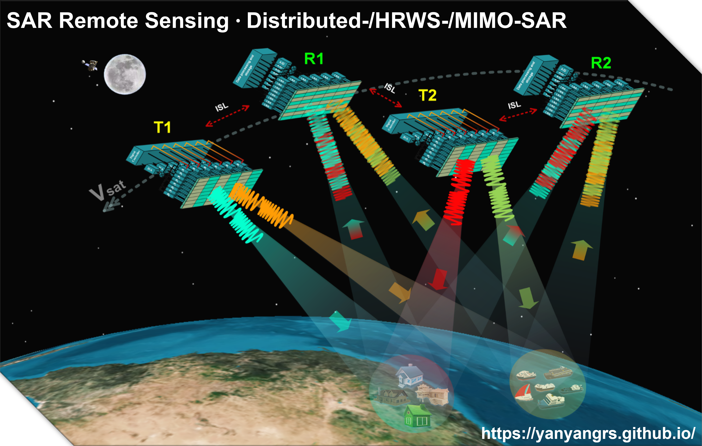

## 👨‍🔬 Biography
Dr. Zhang has been conducting research on Synthetic Aperture Radar (SAR) since 2016, with a particular focus on signal processing methods for bistatic and multistatic SAR, as well as high-resolution wide-swath (HRWS) SAR.
 
He is currently a JSPS PostDoc Fellow with Hirose & Natsuaki Laboratory at The University of Tokyo, Tokyo, Japan, where he is working on MIMO-SAR for HRWS imaging and azimuth ambiguity suppression for HRWS-SAR. 

---

## 🔬 Research Interests
* 🛰️ Distributed SAR (clock synchronization, satellite formation, DEM generation)
* 📡 HRWS-SAR (azimuth multichannel, elevation digital beamforming, variable PRI)
* 🌍 MIMO-SAR (orthogonal encoding waveform, echo seperation methods)
* ⚡ SAR imaging systems, signal model, and imaging methods
* 🌱 SAR applications for Earth observation (e.g., InSAR, TomoSAR)

---

## 🎓 Experience & Education
* The University of Tokyo, Tokyo, Japan (JSPS PostDoc Fellow), 2025-Present
* ETH Zürich, Zürich, Switzerland (PostDoc), 2023-2025
* National Key Laboratory of Microwave Imaging, Beijing, China (Senior Scientist), 2022-2023
* University of Chinese Academy of Sciences & AIRCAS, Beijing, China (Ph.D. Degree), 2017-2022
* Hunan University, Changsha, China (Bachelor Degree), 2013-2017

---

## 📚 Journal

### 2026
* **Yanyan Zhang**, Akira Hirose, Wei Cao, Ryo Natsuaki, [Azimuth Resolution Enhancement in MIMO-SAR: Signal Model and Imaging Method](https://ieeexplore.ieee.org/abstract/document/11527408), *IEEE Transactions on Geoscience and Remote Sensing*, 2026.

### 2025
* **Yanyan Zhang**, Akira Hirose, Ryo Natsuaki, [Virtual Delay-Emission (VDE): An HRWS Imaging Mode for Spaceborne MIMO-SAR](https://ieeexplore.ieee.org/abstract/document/11261862), *IEEE Geoscience and Remote Sensing Letters*, 2025.
* **Yanyan Zhang**, Akira Hirose, Ryo Natsuaki, [A Sequential Doppler Offset (SDO) Method for Locating Targets Causing Azimuth Fractional Ambiguity in Spaceborne HRWS-SAR](https://ieeexplore.ieee.org/abstract/document/11250667), *IEEE Geoscience and Remote Sensing Letters*, 2025.
* Lizhi Liu, Pingping Lu, Cheng Xing, **Yanyan Zhang**, Yonghua Cai, Fei Zhao, Bo Li, Liang Li, Aichun Wang, Ning Li, Robert Wang, Yirong Wu, [LuTan-1: First Demonstration of Hybrid-Polarimetric Synthetic Aperture Radar-Assessing Application Potentials and Performance Constraints](https://spj.science.org/doi/full/10.34133/remotesensing.1025), *Journal of Remote Sensing*, 2025.

### 2024
* **Yanyan Zhang**, Pingping Lu, Robert Wang, [New Insights Into Alternating Transmitting Mode (ATM) for Bistatic Multichannel SAR](https://ieeexplore.ieee.org/abstract/document/10535964), *IEEE Transactions on Geoscience and Remote Sensing*, 2024.
* **Yanyan Zhang**, Junfeng Li, Pingping Lu, Tianyuan Yang, Robert Wang, [Demonstration of Phase-Preserving Synchronization RFI Suppression for L-Band Spaceborne Bistatic Interferometric SAR](https://ieeexplore.ieee.org/abstract/document/10742483), *IEEE Journal of Selected Topics in Applied Earth Observations and Remote Sensing*, 2024.
* **Yanyan Zhang**, Junfeng Li, Pingping Lu, Robert Wang, [An Advanced Interferometric Baseline Estimation Method (IBEM) for Spaceborne Bistatic SAR](https://ieeexplore.ieee.org/abstract/document/10528663), *IEEE Journal of Selected Topics in Applied Earth Observations and Remote Sensing*, 2024.
* Junfeng Li, Yonghua Cai, **Yanyan Zhang**, Da Liang, Yijiang Nan, Bo Li, Kaiyu Liu, Robert Wang, [RFI Suppression Scheme for Complicated Low-Rank Violation Cases](https://ieeexplore.ieee.org/abstract/document/10508214), *IEEE Transactions on Geoscience and Remote Sensing*, 2024.

### 2023
* **Yanyan Zhang**, Pingping Lu, Robert Wang, [An Innovative Link-Free Permanent-C (LFPC) Phase Synchronization Scheme for Distributed SAR](https://ieeexplore.ieee.org/abstract/document/10288508), *IEEE Geoscience and Remote Sensing Letters*, 2023.
* Bo Li, Qingchao Zhao, **Yanyan Zhang**, Da Liang, Wei Wang, Yonghua Cai, Junfeng Li, Pingping Lu, Robert Wang, [An Advanced Sparse Multichannel System for Spaceborne DBF-SAR](https://ieeexplore.ieee.org/abstract/document/10183840), *IEEE Transactions on Geoscience and Remote Sensing*, 2023.
* Yonghua Cai, Junfeng Li, Yachao Wang, Qingyue Yang, **Yanyan Zhang**, Yafeng Chen, Pingping Lu, Robert Wang, [Detecting and Removing Phase Jitters for the Phase Synchronization of LT-1 Bistatic SAR](https://ieeexplore.ieee.org/abstract/document/10265232), *IEEE Geoscience and Remote Sensing Letters*, 2023.

### 2022
* **Yanyan Zhang**, Shuo Han, Tiantian Wei, Wei Wang, Yunkai Deng, Guodong Jin, Yongwei Zhang, Robert Wang, [First Demonstration of Echo Separation for Orthogonal Waveform Encoding MIMO-SAR Based on Airborne Experiments](https://ieeexplore.ieee.org/document/9737145), *IEEE Transactions on Geoscience and Remote Sensing*, 2022.
* **Yanyan Zhang**, Ruwei Zhang, Robert Wang, Heng Zhang, [The Real-Time Framework of the Push-To-Talk (PTT) Synchronization Scheme for Distributed SAR](https://ieeexplore.ieee.org/abstract/document/9775762), *IEEE Geoscience and Remote Sensing Letters*, 2022.
* **Yanyan Zhang**, Fei Zhao, Sheng Chang, Mingliang Liu, Robert Wang, [An Innovative Synthetic Aperture Radar Design Method for Lunar Water-ice Exploration](https://www.mdpi.com/2072-4292/14/9/2148), *Remote Sensing*, 2022.
* **Yanyan Zhang**, Sheng Chang, Robert Wang, Peng Li, Yongwei Zhang, Yunkai Deng, [A Novel Weighted Amplitude Modulation (WAM) System for Ambiguity Suppression of Spaceborne Hybrid Quad-Pol SAR](https://www.mdpi.com/2072-4292/14/1/155), *Remote Sensing*, 2022.
* Sheng Chang, Yunkai Deng, **Yanyan Zhang**, Qingchao Zhao, Robert Wang, Ke Zhang, [An Advanced Scheme for Range Ambiguity Suppression of Spaceborne SAR Based on Blind Source Separation](https://ieeexplore.ieee.org/abstract/document/9801865), *IEEE Transactions on Geoscience and Remote Sensing*, 2022.
* Shuo Han, Yunkai Deng, Qingchao Zhao, Yongwei Zhang, **Yanyan Zhang**, Wei Wang, [On Spaceborne DBF-SAR Adopting the Degree of Freedom With NLFM Waveform: Optimization Framework and Simulation](https://ieeexplore.ieee.org/abstract/document/9793604), *IEEE Transactions on Geoscience and Remote Sensing*, 2022.
* Shuohan Cheng, Xilong Sun, Yonghua Cai, Huifang Zheng, Weidong Yu, **Yanyan Zhang**, Sheng Chang, [A Joint Azimuth Multichannel Cancellation (JAMC) Antibarrage Jamming Scheme for Spaceborne SAR](https://ieeexplore.ieee.org/abstract/document/9946302), *IEEE Journal of Selected Topics in Applied Earth Observations and Remote Sensing*, 2022.
* Sheng Chang, Yunkai Deng, **Yanyan Zhang**, Rongxiang Wang, Jinsong Qiu, Wei Wang, Qingchao Zhao, Dacheng Liu, [An Advanced Echo Separation Scheme for Space-Time Waveform-Encoding SAR Based on Digital Beamforming and Blind Source Separation](https://www.mdpi.com/2072-4292/14/15/3585), *Remote Sensing*, 2022.
* Chengcheng Pang, Huachun Zhang, **Yanyan Zhang**, [An End-to-End Multi-Scale Lunar Craters Detection Method](http://radarst.cnjournals.com/ldkxyjs/ch/reader/view_abstract.aspx?file_no=202201010), *Radar Science and Technology*, 2022.

### 2021
* **Yanyan Zhang**, Sheng Chang, Robert Wang, Yunkai Deng, [An Innovative Push-To-Talk (PTT) Synchronization Scheme for Distributed SAR](https://ieeexplore.ieee.org/abstract/document/9513476), *IEEE Transactions on Geoscience and Remote Sensing*, 2021.
* **Yanyan Zhang**, Hao Zhang, Shuai Hou, Yunkai Deng, Weidong Yu, Robert Wang, [An Innovative Superpolyhedron (SP) Formation for Multistatic SAR (M-SAR) Interferometry](https://ieeexplore.ieee.org/abstract/document/9335955), *IEEE Transactions on Geoscience and Remote Sensing*, 2021.
* Ce Yang, Naiming Ou, Yunkai Deng, Dacheng Liu, **Yanyan Zhang**, Nan Wang, Robert Wang, [Pattern Synthesis Algorithm for Range Ambiguity Suppression in the LT-1 Mission via Sequential Convex Optimizations](https://ieeexplore.ieee.org/abstract/document/9506985), *IEEE Transactions on Geoscience and Remote Sensing*, 2021.
* Peng Li, Fengjun Zhao, Dacheng Liu, Naiming Ou, Chengbo Cao, Xiuqing Liu, **Yanyan Zhang**, Yunkai Deng, Robert Wang, [First Demonstration of Hybrid Quad-Pol SAR Based on P-Band Airborne Experiment](https://ieeexplore.ieee.org/abstract/document/9455129), *IEEE Transactions on Geoscience and Remote Sensing*, 2021.

### 2020
* **Yanyan Zhang**, Robert Wang, Wei Wang, Yunkai Deng, [An Innovative Multiswath Jump Imaging Mode for Spaceborne SAR](https://ieeexplore.ieee.org/abstract/document/9107419), *IEEE Geoscience and Remote Sensing Letters*, 2020.

### 2019
* **Yanyan Zhang**, Heng Zhang, Naiming Ou, Kaiyu Liu, Da Liang, Yunkai Deng, Robert Wang, [First Demonstration of Multipath Effects on Phase Synchronization Scheme for LT-1](https://ieeexplore.ieee.org/abstract/document/8920229), *IEEE Transactions on Geoscience and Remote Sensing*, 2019.
* Guodong Jin, Kaiyu Liu, Dacheng Liu, Da Liang, Heng Zhang, Naiming Ou, **Yanyan Zhang**, Yunkai Deng, Chuang Li, Robert Wang, [An Advanced Phase Synchronization Scheme for LT-1](https://ieeexplore.ieee.org/abstract/document/8889717), *IEEE Transactions on Geoscience and Remote Sensing*, 2019.
* Chuang Li, Heng Zhang, Yunkai Deng, Robert Wang, Kaiyu Liu, Dacheng Liu, Guodong Jin, **Yanyan Zhang**, [Focusing the L-Band Spaceborne Bistatic SAR Mission Data Using a Modified RD Algorithm](https://ieeexplore.ieee.org/abstract/document/8835119), *IEEE Transactions on Geoscience and Remote Sensing*, 2019.

---

## 📚 Conference
* The Joint PI Meeting of JAXA Earth Observation Missions FY2025
* IEEE Asia-Pacific Geoscience and Remote Sensing Symposium (AP-GARSS) 2026
* European Conference on Synthetic Aperture Radar (EUSAR) 2026
* EUSAR 2024
* EUSAR 2021
* IEEE International Geoscience and Remote Sensing Symposium (IGARSS) 2026
* IEEE IGARSS 2025
* IEEE IGARSS 2024
* IEEE IGARSS 2023
* IEEE IGARSS 2022
* IEEE IGARSS 2021
* IEEE Radar Conference 2020
* Asia-Pacific Conference on Synthetic Aperture Radar (APSAR) 2019

---

## 📄 Academic Roles
* Guest editor for Special Issues of Remote Sensing
* IEEE International Conference on Signal Processing and Information Security, TPC, 2026
* IEEE IGARSS, Scientific Committee, 2026
* IEEE IGARSS, Scientific Committee, 2025
* Session Chair for IEEE IGARSS 2025
* Session Co-chair for EUSAR 2024
* Invited reviewer for IEEE TGRS/IEEE TIP/IEEE TAES/IEEE TRS/IEEE JSTARS/IEEE GRSL/ISPRS Journal of Photogrammetry and Remote Sensing/Communications Earth & Environment/IEEE Access/IEEE Sensors Journal/Remote Sensing/Remote Sensing Letters/IEE Electronics Letters...

---

## 🔗 Academic Links
* 💼 **Linkedin:** [Yanyan Zhang](https://www.linkedin.com/in/yanyan-zhang-2b35b4307/)
* 🎓 **Google Scholar:** [Yanyan Zhang](https://scholar.google.com/citations?user=sD4C7tkAAAAJ&hl=en)
* 🆔 **ORCID:** [0000-0002-3497-4474](https://orcid.org/0000-0002-3497-4474)
* 📧 **Email:** [yanyanzhang@eis.t.u-tokyo.ac.jp](#) / [caszyymail@163.com](#)

<b>SAR Remote Sensing · Distributed SAR · HRWS-SAR · MIMO-SAR</b>

<i>Exploring advanced SAR technologies for high-precision Earth observation.</i>

